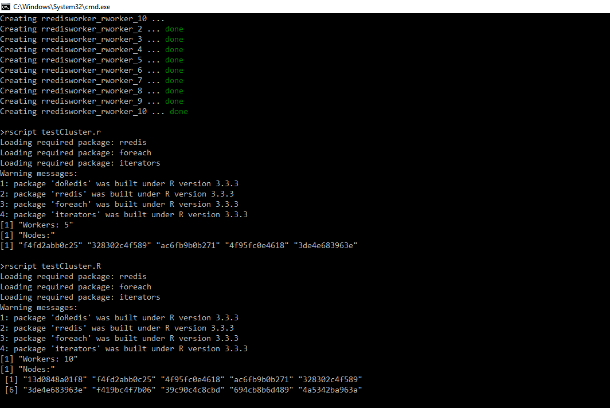

# Sample docker images for R cluster tests using doRedis backend

note: pure r&d/tests, not production ready!

## stand alone docker-compose
~~~~
test-compose.cmd
~~~~
or
~~~~~
docker-compose up -d 
docker-compose scale rworker=10
rscript testCluster.r
~~~~~~

## docker swarm  docker-compose
~~~~
test-swarm.cmd
~~~~
or
~~~~~
docker stack deploy --compose-file docker-compose-swarm.yml rcluster

docker stack  services rcluster

docker service scale rcluster_rworker=20
~~~~~~

## Connecting from the R client session & schedule jobs with foreach dopar

note: Please install doRedis 1.2.0 from github with devtools on the local R env, CRAN version is outdated

~~~~
library('doRedis')

#connect redis queues
registerDoRedis('r_jobs', host='localhost', port=6379)

options('redis:num'=TRUE)

#Check workers
nWorkers=getDoParWorkers()
print(paste0("Workers: ",nWorkers))

setProgress(TRUE)

#Test Job & check nodes
nodes=foreach(j=1:10) %dopar%
{(system('hostname',intern=T))}
nodes=unique(unlist(nodes))

print("Nodes:")
nodes
~~~~

## Add your local cores to the cluster

~~~~
doRedis::startLocalWorkers(3,'r_jobs',host='localhost')

~~~~

## Notes/Todo

- TODO - Although the clients seem to hang on "Connecting to redis", they are seem to be properly registered and working
- TODO - test best ways of making the redis channel secure, spiped, ssh tunnels others

## References/Related
- https://github.com/trcook/rdockerHPC
- http://www.fransvandunne.com/parallel-r-in-docker-containers/
